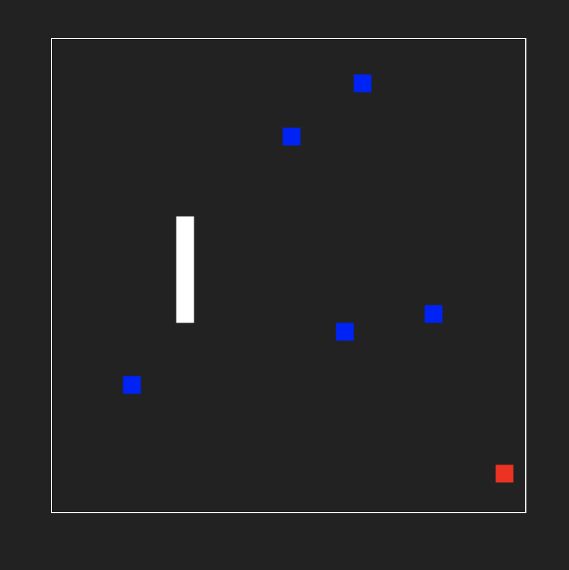

# Cobra with GPT

It's snake geme built by ChatGPT4. Inspired by [Web Summit Rio 2023: Building an app in 18 minutes with GitHub Copilot X](https://github.blog/2023-05-05-web-summit-rio-2023-building-an-app-in-18-minutes-with-github-copilot-x/)



[Play Now!!](https://nipe0324.github.io/cobra-with-gpt/)

## Prompts

#### User: What is snake game?

Snake is a classic video game that became popular in the late 1970s and gained widespread recognition in the 1990s when it was preloaded on Nokia mobile phones. The game features a simple concept: the player controls a snake that moves around the screen, consuming food items to grow longer. The snake moves in a straight line and can only change direction at right angles.

The primary objective of the game is to eat as many food items as possible without the snake's head colliding with its own body or the screen boundaries. As the snake consumes food, it grows longer, making it increasingly challenging for the player to avoid collisions. The game ends when the snake eventually crashes into itself or the screen edge, and the player's score is based on the number of food items consumed.


#### User: Create the code for a snake game in JavaScript

Creating a complete snake game in JavaScript requires HTML and CSS as well. Here's a simple implementation of the snake game using these three languages:

1. HTML: Create a basic structure for the game canvas.

```html
<!DOCTYPE html>
<html lang="en">
<head>
    <meta charset="UTF-8">
    <meta name="viewport" content="width=device-width, initial-scale=1.0">
    <title>Snake Game</title>
    <link rel="stylesheet" href="styles.css">
</head>
<body>
    <canvas id="gameCanvas" width="400" height="400"></canvas>
    <script src="snake.js"></script>
</body>
</html>
```

2. CSS: Add styles for the canvas.

```css
body {
    display: flex;
    justify-content: center;
    align-items: center;
    height: 100vh;
    margin: 0;
    background-color: #222;
}

canvas {
    border: 1px solid #fff;
}
```

3. JavaScript: Implement the game logic.

```js
const canvas = document.getElementById('gameCanvas');
const ctx = canvas.getContext('2d');

const scale = 20;
const rows = canvas.height / scale;
const columns = canvas.width / scale;

let snake;

(function setup() {
    snake = new Snake();
    fruit = new Fruit();

    fruit.pickLocation();

    window.setInterval(() => {
        ctx.clearRect(0, 0, canvas.width, canvas.height);
        fruit.draw();
        snake.update();
        snake.draw();

        if (snake.eat(fruit)) {
            fruit.pickLocation();
        }

        snake.checkCollision();
    }, 250);
}());

function Snake() {
    this.x = 0;
    this.y = 0;
    this.xSpeed = scale;
    this.ySpeed = 0;
    this.total = 0;
    this.tail = [];

    this.draw = function() {
        ctx.fillStyle = "#fff";

        for (let i = 0; i < this.tail.length; i++) {
            ctx.fillRect(this.tail[i].x, this.tail[i].y, scale, scale);
        }

        ctx.fillRect(this.x, this.y, scale, scale);
    }

    this.update = function() {
        for (let i = 0; i < this.tail.length - 1; i++) {
            this.tail[i] = this.tail[i + 1];
        }

        this.tail[this.total - 1] = { x: this.x, y: this.y };

        this.x += this.xSpeed;
        this.y += this.ySpeed;

        if (this.x >= canvas.width) {
            this.x = 0;
        }

        if (this.y >= canvas.height) {
            this.y = 0;
        }

        if (this.x < 0) {
            this.x = canvas.width;
        }

        if (this.y < 0) {
            this.y = canvas.height;
        }
    }

    this.changeDirection = function(direction) {
        switch(direction) {
            case 'Up':
                this.xSpeed = 0;
                this.ySpeed = -scale;
                break;
            case 'Down':
                this.xSpeed = 0;
                this.ySpeed = scale;
                break;
            case 'Left':
                this.xSpeed = -scale;
                this.ySpeed = 0;
                break;
            case 'Right':
                this.xSpeed = scale;
                this.ySpeed = 0;
                break;
        }
    }

    this.eat = function(fruit) {
        if (this.x === fruit.x && this.y === fruit.y) {
            this.total++;
```

#### What next is JavaScript?

Apologies for the abrupt ending in my previous response. Here is the continuation of the Snake game code in JavaScript:

```js
            return true;
        }

        return false;
    }

    this.checkCollision = function() {
        for (let i = 0; i < this.tail.length; i++) {
            if (this.x === this.tail[i].x && this.y === this.tail[i].y) {
                this.total = 0;
                this.tail = [];
            }
        }
    }
}

function Fruit() {
    this.x;
    this.y;

    this.pickLocation = function() {
        this.x = (Math.floor(Math.random() * columns - 1) + 1) * scale;
        this.y = (Math.floor(Math.random() * rows - 1) + 1) * scale;
    }

    this.draw = function() {
        ctx.fillStyle = "#f00";
        ctx.fillRect(this.x, this.y, scale, scale);
    }
}

window.addEventListener('keydown', ((evt) => {
    const direction = evt.key.replace('Arrow', '');
    snake.changeDirection(direction);
}));
```

This code completes the basic snake game implementation. The Snake and Fruit objects are defined with their respective methods, and the game loop is set up with setInterval. The game responds to arrow key inputs to change the direction of the snake, and it updates the snake's position and checks for collisions.

Please make sure you've added this to the 'snake.js' file referenced in the HTML file.

#### How can I call this code?


To run the Snake game code provided above, follow these steps:

1. Create a new directory (folder) for the project, e.g., `snake_game`.
2. Inside the `snake_game` directory, create three files:
    - `index.html`: Copy and paste the HTML code provided earlier.
    - `styles.css`: Copy and paste the CSS code provided earlier.
    - `snake.js`: Copy and paste the JavaScript code provided earlier.
3. Open the `index.html` file in a web browser (e.g., Chrome, Firefox, Safari, etc.). You should see the Snake game canvas, and the game will start automatically.

Note: The provided JavaScript code is incomplete, and some functions are missing. You'll need to complete the code to make the game fully functional.

#### How do I make the snake crash into the screen edge?

To make the snake crash into the screen edges and end the game, you need to modify the `update` function in the `Snake` object within the `snake.js` file. The current code wraps the snake around the screen when it reaches the edges, but you can change it to check for collisions with the edges instead.

Here's the updated `update` function:

```js
this.update = function () {
    for (let i = 0; i < this.tail.length - 1; i++) {
        this.tail[i] = this.tail[i + 1];
    }

    this.tail[this.total - 1] = { x: this.x, y: this.y };

    this.x += this.xSpeed;
    this.y += this.ySpeed;

    // Check for collisions with the screen edges
    if (this.x >= canvas.width || this.y >= canvas.height || this.x < 0 || this.y < 0) {
        this.total = 0;
        this.tail = [];
        this.x = 0;
        this.y = 0;
        this.xSpeed = scale;
        this.ySpeed = 0;
    }
}
```

Now, when the snake's head hits any screen edge, the game will reset the snake's size and position, and the snake will start moving to the right.

Save the changes in the `snake.js` file, and refresh the `index.html` file in your browser to see the updated behavior.

#### How to add obstacles to the game?

To add obstacles to the Snake game, you can create a new object called Obstacle and modify the game loop to include generating and drawing obstacles. Here's how you can do this:

1. In the `snake.js` file, create the` Obstacle` object with a constructor function, similar to the `Fruit` object:

```js
function Obstacle() {
    this.x;
    this.y;

    this.pickLocation = function () {
        this.x = (Math.floor(Math.random() * columns - 1) + 1) * scale;
        this.y = (Math.floor(Math.random() * rows - 1) + 1) * scale;
    }

    this.draw = function () {
        ctx.fillStyle = "#00f";
        ctx.fillRect(this.x, this.y, scale, scale);
    }
}
```

2. Create an array to store multiple obstacles and modify the `setup` function to generate a given number of obstacles:

```js
let obstacles = [];
const numberOfObstacles = 5;

(function setup() {
    // ... existing code ...

    for (let i = 0; i < numberOfObstacles; i++) {
        const obstacle = new Obstacle();
        obstacle.pickLocation();
        obstacles.push(obstacle);
    }

    // ... existing code ...
}());
```

3. Modify the game loop to draw the obstacles:

```js
window.setInterval(() => {
    // ... existing code ...

    for (const obstacle of obstacles) {
        obstacle.draw();
    }

    // ... existing code ...
}, 250);
```

4. Add a method to the `Snake` object to check for collisions with obstacles:

```js
this.collidesWithObstacle = function (obstacles) {
    for (const obstacle of obstacles) {
        if (this.x === obstacle.x && this.y === obstacle.y) {
            return true;
        }
    }
    return false;
}
```

5. Update the `update` function to check for collisions with obstacles and reset the snake if it collides with any obstacle:

```js
this.update = function () {
    // ... existing code ...

    // Check for collisions with obstacles
    if (this.collidesWithObstacle(obstacles)) {
        this.total = 0;
        this.tail = [];
        this.x = 0;
        this.y = 0;
        this.xSpeed = scale;
        this.ySpeed = 0;
    }
}
```

Now, when you save the changes in the `snake.js` file and refresh the `index.html` file in your browser, you should see obstacles on the game screen. The snake will reset its size and position if it collides with any of the obstacles. You can adjust the `numberOfObstacles` variable to change the number of obstacles in the game.
